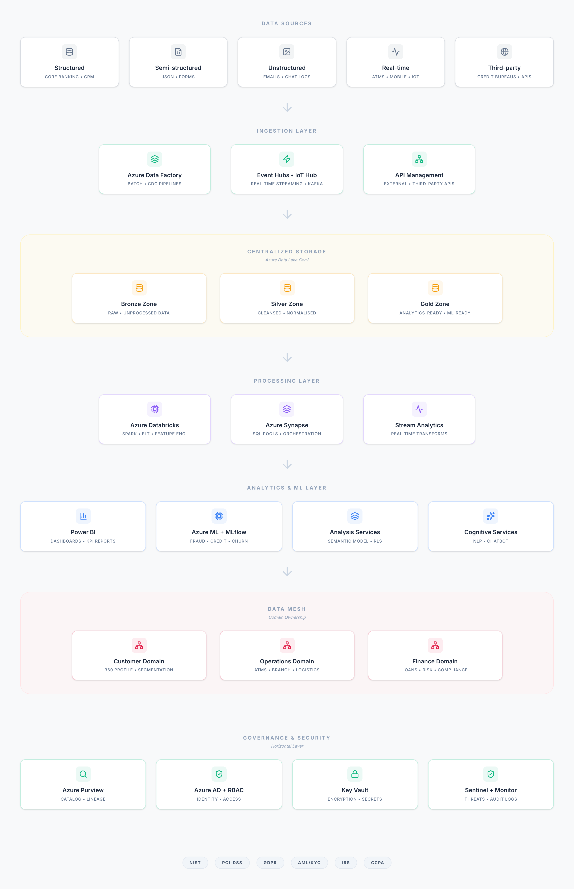

# 🏦 Cloud Data Platform Design — Banco Wild West

> End-to-end enterprise data platform architecture for a regional bank migrating from legacy infrastructure to a modern, cloud-native Azure-based analytics ecosystem.

**Client:** Banco Wild West (regional banking institution — academic case study)  
**Platform:** Microsoft Azure  
**Role:** Data Platform Architect · Business Analyst · Requirements Lead  
**Institution:** UT Dallas — BUAN 6335 · Data Platform Design  

---

## 📌 Project Overview

Banco Wild West operates on a legacy N-tier architecture with traditional RDBMS and Teradata data warehouses. This project designs a comprehensive migration to a unified, cloud-native data platform that supports real-time analytics, machine learning, regulatory compliance, and domain-driven data ownership.

The deliverable is a fully documented platform architecture — not an implementation — covering requirements gathering, infrastructure design, data governance, ML use case definition, and a phased implementation roadmap.

> **BA framing:** This project demonstrates the full business analyst lifecycle: stakeholder requirements → architecture design → vendor evaluation → ML use case definition → KPI framework → implementation roadmap.

---

## 🏗️ Architecture Overview



The platform is structured across 7 layers, each serving a distinct function in the data lifecycle:

| Layer | Components | Purpose |
|---|---|---|
| **Data Sources** | Core banking, CRM, IoT/ATMs, APIs, unstructured | 5 data source categories ingested |
| **Ingestion** | Azure Data Factory, Event Hubs, IoT Hub, API Management | Batch, micro-batch, and real-time streaming |
| **Storage** | Azure Data Lake Gen2 — Bronze / Silver / Gold zones | Unified, tiered, scalable data lake |
| **Processing** | Azure Databricks, Synapse Analytics, Stream Analytics | ELT, Spark, real-time transforms |
| **Analytics & ML** | Power BI, Azure ML, MLflow, Cognitive Services | Dashboards, predictive models, NLP |
| **Data Mesh** | Customer, Operations, Finance domains | Decentralised domain ownership |
| **Governance & Security** | Purview, Azure AD, Key Vault, Sentinel | Catalog, lineage, encryption, SIEM |

---

## ❗ Problem Statement

Banco Wild West's legacy infrastructure creates four critical business problems:

**1. Data silos** — Customer data is scattered across checking, loan, and credit card systems with no unified view, making personalised service and cross-sell targeting impossible.

**2. Batch-only processing** — Overnight batch updates create multi-hour delays in fraud detection, risk scoring, and customer notifications — directly impacting revenue and customer safety.

**3. Limited analytical capability** — The existing Teradata warehouse cannot handle unstructured data (chat logs, call transcripts, social media) or support advanced ML workflows.

**4. Compliance risk** — Manual compliance processes and fragmented audit trails create exposure to NIST, GDPR, PCI-DSS, and AML/KYC regulatory requirements.

---

## ✅ Proposed Solution

A Microsoft Azure cloud-native platform addressing all four problems through:

- **Unified Data Lake** (ADLS Gen2) with Bronze/Silver/Gold zones replacing fragmented silos
- **Real-time streaming** via Azure Event Hubs enabling sub-second fraud detection
- **ML pipeline** (Azure ML + Databricks) supporting 8 production use cases
- **Automated compliance** via Azure Purview with built-in NIST, GDPR, PCI-DSS controls

---

## 🤖 Machine Learning Use Cases

Eight ML use cases were designed with target KPIs:

| Use Case | Model Type | Target KPI |
|---|---|---|
| Real-time fraud detection | Streaming anomaly detection + Random Forest | 90% detection rate, 20% loss reduction |
| Loan risk assessment | XGBoost + Logistic Regression | AUC > 0.85, 40% fewer manual reviews |
| Hyper-personalisation | Collaborative filtering + gradient boosting | 5–10% uplift in cross-sell conversion |
| Predictive ATM maintenance | Random Forest + survival analysis | 30% fewer unplanned downtime incidents |
| Dynamic credit scoring | LSTM + ensemble models | 15% improvement in risk-adjusted lending |
| Conversational AI chatbot | Transformer-based intent classifier | 80% containment rate, 25% call reduction |
| Staff scheduling optimisation | Prophet + integer programming | 15% reduction in staffing costs |
| AML & compliance monitoring | Graph analytics + Isolation Forest | 20% fewer false positives |

---

## 📐 Data Mesh Architecture

The platform adopts domain-driven data ownership across three mesh domains:

**Customer Domain** (Retail Banking & CX)
- Customer 360 profile, segmentation datasets, lifecycle event streams
- PII masking and tokenisation enforced at ingestion

**Operations Domain** (Infrastructure & Ops)
- ATM telemetry, branch foot traffic, cash logistics forecasts
- <1 minute data freshness SLA enforced via monitoring alerts

**Finance Domain** (Risk & Compliance)
- Loan portfolios, credit exposure, risk scores, investment performance
- Automated compliance checks (IFRS, AML thresholds) embedded in ETL

Each domain owns its pipelines, quality rules, and consumption interfaces — governed by shared Azure Purview standards.

---

## 🔒 Security & Compliance

| Framework | Implementation |
|---|---|
| **NIST SP 800-53** | Security controls mapped to platform configurations |
| **PCI-DSS** | Cardholder data environment isolated with strict encryption |
| **GDPR / CCPA** | Data subject rights via Purview discovery and deletion workflows |
| **AML / KYC** | Monitoring and alerting for suspicious activity reporting |
| **IRS** | Federal compliance embedded in Finance data mesh domain |

Security controls: AES-256 encryption at rest · TLS 1.2+ in transit · Azure AD SSO + MFA · RBAC with PIM · Private Link network isolation · Immutable audit logs (7+ years)

---

## 📊 Vendor Evaluation

Three cloud providers were evaluated against service completeness, security, cost model, and ecosystem compatibility:

| Criteria | Azure ✅ | AWS | GCP |
|---|---|---|---|
| Financial compliance (NIST, PCI-DSS, AML/KYC) | Native | Extensive | Partial |
| Microsoft ecosystem integration (Power BI, Excel) | Native | Extra config | Limited |
| Pricing model | Pay-as-you-go + reserved | Flexible + spot | Competitive |
| Data services completeness | Full stack | Full stack | Strong analytics |

**Recommendation: Microsoft Azure** — optimal for Banco Wild West given existing Microsoft tooling, native financial compliance, and seamless Power BI integration.

---

## 🗓️ Implementation Roadmap

| Phase | Timeline | Key Deliverables | Success Gate |
|---|---|---|---|
| 1 — Foundation | Jun–Jul 2025 | Azure tenant, ADLS Gen2, AAD, Key Vault, CI/CD | Environment validated |
| 2 — Data Integration | Aug–Sep 2025 | Ingestion pipelines, Bronze/Silver zones, Purview catalog | Data flowing to lake |
| 3 — Analytics & Governance | Oct–Nov 2025 | Databricks ETL, Power BI dashboards, governance rules | KPIs visible in BI |
| 4 — Advanced Analytics | Dec 2025 | ML models deployed, user training, performance tuning | All 8 ML use cases live |

---

## 📈 Expected Business Outcomes

| Outcome | Target |
|---|---|
| Infrastructure cost reduction | 20% vs legacy Teradata |
| Interactive query latency | 95% of queries < 1 second |
| Fraud detection rate | 90% with sub-second scoring |
| Cross-sell conversion uplift | 5–10% via personalisation ML |
| Platform uptime SLA | 99.9% availability |
| Compliance audit pass rate | 100% internal and external |

---

## 📁 Repository Structure

```
├── OBAP_Project_Report.pdf          # Full platform design report (26 pages)
├── banco_wildwest_architecture.png  # Architecture diagram (all 7 layers)
├── README.md
```

---

## 🛠️ Technologies Referenced

**Cloud Platform:** Microsoft Azure  
**Storage:** Azure Data Lake Gen2, Blob Storage, Delta Lake format  
**Processing:** Azure Databricks (Spark), Azure Synapse Analytics, Azure Stream Analytics  
**Ingestion:** Azure Data Factory, Event Hubs, IoT Hub, API Management, Apache Kafka  
**ML & AI:** Azure Machine Learning, MLflow, Cognitive Services  
**Analytics:** Power BI (Pro + Premium), Azure Analysis Services, Synapse Studio  
**Governance:** Azure Purview, Master Data Management  
**Security:** Azure Active Directory, Key Vault, Sentinel, Defender for Cloud  
**DevOps:** Azure DevOps, GitHub Actions, ARM/Terraform (IaC)

---

## 📋 Project Context

This is an academic architecture design project completed as part of BUAN 6335 — Data Platform Design at the University of Texas at Dallas. The deliverable is a strategic design document and architecture blueprint. No cloud resources were provisioned; all design decisions are grounded in Azure documentation, industry best practices, and academic research.

This project demonstrates business analyst competencies in: requirements gathering · stakeholder analysis · vendor evaluation · solution architecture documentation · ML use case framing · compliance mapping · implementation roadmap planning.

---

## 👤 Author

**Aryaa Singh**  
MS Business Analytics & Artificial Intelligence — University of Texas at Dallas  
[LinkedIn](https://linkedin.com/in/aryaasingh) · [GitHub](https://github.com/YOUR_USERNAME)

---

## 📄 License

MIT License — see [LICENSE](LICENSE) for details.
